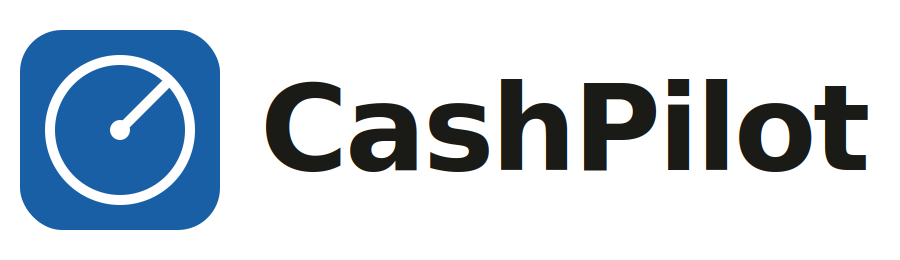

<div align="center">



### Real-time cash monitoring for independent ATM operators

**Only drive when it matters.** Know which machines need cash before you leave the house. Skip wasted trips. Never lose a Friday night to an empty machine.

[](https://cash-pilot-inky.vercel.app/)
[](https://github.com/jdbostonbu-ops/CashPilot)

<br />


</div>

---

## About CashPilot

CashPilot is a mobile-first monitoring service built for the 450,000+ independent ATM operators in the United States. Every operator — from solo route runners to established fleets — deals with the same daily problem: driving to a machine that didn't need cash, or worse, missing a machine that ran empty during peak hours. CashPilot solves that with real-time cash monitoring, distance-based alert thresholds, and smart route sequencing that adapts to how the operator actually works.

The mobile app is currently in development. This repository contains the go-to-market landing page and the automated lead-qualification pipeline that runs behind it.

## Why it matters

Independent ATM operators are running blind. Every route runs on gut feel and manual dashboard-checking, which leads to real costs:

- Fuel, time, and vehicle wear burned on trips to machines that didn't need service
- Empty machines during peak hours (Friday nights at bars, weekends at dispensaries) losing $150+ per outage in missed surcharge revenue
- 15+ hours a week spent staring at dashboards and calling machines one at a time to check cash levels
- No existing tool uses distance-based logic — a machine 8 minutes away shouldn't have the same refill threshold as one 90 minutes out

## Features

- **Smart route sequencing** — when multiple machines need service, the app sequences them into the fastest loop
- **Distance-based alert thresholds** — set how far you are from each machine, and CashPilot adjusts when it pings you
- **Real-time cash monitoring** across every machine in the route

## Pricing tiers

Displayed on the landing page:

| Tier | Monthly | Machines | Best for |
|------|---------|----------|----------|
| Solo | **$39/mo** | Up to 4 | Solo operators just getting started |
| Route | **$29/mo** | 5 – 24 | Growing operators building a route |
| Fleet | **$19/mo** | 25+ | Established fleets running multi-state operations |

Plus a one-time setup fee of **$200 – $500** depending on installation path (self-install vs. CashPilot-managed install).

## Tech stack

**Frontend**
- Next.js 14 (App Router)
- TypeScript (strict mode, no `any`, no `var`)
- React
- CSS Modules with global design tokens

**Integrations (test mode)**
- **Stripe** — Checkout Sessions for tiered subscription payments
- **Cal.com** — booking scheduler for demo calls with custom machine-count qualification question
- **Zapier** — automated lead qualification pipeline (Cal.com → AI classification → filter → Google Sheets)
- **Formspree** — form submissions for the bottom-of-page contact CTA

**Deployment**
- Vercel (production)
- GitHub (source control)

## Behind the scenes — how leads get qualified

Every "Book a 15-min call" click on the landing page fires a Zapier automation:

1. **Cal.com trigger** — new booking with prospect name, email, machine count, and notes
2. **AI by Zapier** — classifies the booking by tier (Solo / Route / Fleet), priority (high / medium / low / skip), and generates a one-sentence prep note
3. **Filter by Zapier** — drops any booking rated "skip" (spam, blank forms, unqualifiable)
4. **Google Sheets** — logs every qualified booking to a "CashPilot Bookings" sheet, revenue-ranked for morning prep

This runs as internal ops tooling so the founder never walks into a demo call cold and high-value fleet prospects don't get buried under solo-tier inquiries.

## Local development

Clone the repo and install dependencies:

```bash
git clone https://github.com/jdbostonbu-ops/CashPilot.git
cd CashPilot
npm install
```

Create a `.env` file at the project root with the following variables:

```
NEXT_PUBLIC_STRIPE_LINK_SOLO=price_XXXXXXXXXXXX
NEXT_PUBLIC_STRIPE_LINK_ROUTE=price_XXXXXXXXXXXX
NEXT_PUBLIC_STRIPE_LINK_FLEET=price_XXXXXXXXXXXX
NEXT_PUBLIC_BOOKING_URL=https://cal.com/your-username/15min
NEXT_PUBLIC_FORMSPREE_ENDPOINT=https://formspree.io/f/YOUR_ID
STRIPE_SECRET_KEY=sk_test_YOUR_KEY
```

Run the dev server:

```bash
npm run dev
```

Visit `http://localhost:3000`.

## Project structure

```
CashPilot/
├── app/
│   ├── api/checkout/         # Stripe Checkout Session API route
│   ├── success/              # Post-payment success page
│   ├── cancel/               # Post-payment cancel page
│   ├── globals.css           # Design tokens + global styles
│   ├── layout.tsx            # Root layout with font + metadata
│   └── page.tsx              # Landing page composition
├── components/
│   ├── Nav/                  # Sticky navigation
│   ├── Hero/                 # Hero section with primary CTA
│   ├── TrustBar/             # Customer category badges
│   ├── PainSection/          # Problem framing
│   ├── HowItWorks/           # 3-step how-it-works flow
│   ├── ProductScreens/       # App screenshots
│   ├── WhoItsFor/            # Target customer breakdown
│   ├── Features/             # Feature grid
│   ├── Testimonials/         # Operator quotes
│   ├── ImpactStats/          # Results metrics
│   ├── FAQ/                  # Objection-handling FAQ
│   ├── Pricing/              # 3-tier pricing cards
│   ├── FinalCTA/             # Bottom form + closing pitch
│   └── Footer/               # Footer with links
├── lib/
│   └── stripe.ts             # Stripe helper + click handler factory
└── public/                   # Logo, favicons, product screenshots
```

---

<div align="center">

## Author

<a href="https://github.com/jdbostonbu-ops">
  
</a>

**Jacqueline Delgado**
*AI Collaborative Software Engineer · Founder, Hum LLC*

[](https://github.com/jdbostonbu-ops)

<br />

### If CashPilot is useful to you, please star this repo ⭐

[](https://github.com/jdbostonbu-ops/CashPilot)

</div>
